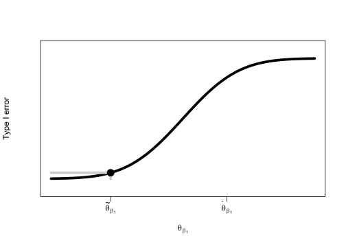
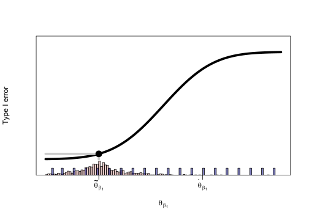

    knitr::opts_chunk$set(dev = 'svg')

# Simultaneous parameter search and simulation

When designing a clinical trial, a key task is to demonstrate the
operating characteristics of the proposed design. This is especially
important for trials designed using Bayesian methods because such
methods do not have built-in type I error control like *p*-value
methods.

One approach for calibrating a Bayesian design to have type I error
control is via the prior distribution on the treatment effect parameter.
(The treatment effect doesn’t necessarily need to be a single parameter;
it could also be a function of several parameters. In this case, a prior
would be placed on the function of parameters.) For example, consider
the simplest setting where the treatment effect is a difference in
means. The model (which includes the expression for the conditional
variance) is

$$
\begin{aligned}
\text{trt} &= \begin{cases} 
1 & \text{active intervention}\\
0 & \text{placebo}
\end{cases}\\
\\\\
E\[y|\text{trt}\] &= \beta\_0 + \beta\_1 \text{trt}\\
V\[y|\text{trt}\] &= \sigma^2\\
\\\\
\beta\_0 &\sim N(0,\theta\_{\beta\_0})\\
\beta\_1 &\sim N(0,\theta\_{\beta\_1})\\
\sigma &\sim \text{exponential}(\theta\_{\sigma}).
\end{aligned}
$$

The parameter *θ**β*1 can be selected/calibrated
so that the trial has a type I error rate of 5%.

Type I error is inherently linked to the decision-making strategy for
the trial. The decision-making strategy is a rule or set of rules which
define a conclusive or reportable difference. In the setting of our
difference in means example, the Bayesian decision making quantity can
be the posterior probability of efficacy,
*P*(*β*1&gt;0|*y*,trt). For example, the rule might be

<table>
<thead>
<tr class="header">
<th style="text-align: center;"><em>P</em>(<em>β</em>1&gt;0|<em>y</em>,trt)</th>
<th style="text-align: left;">Decision</th>
</tr>
</thead>
<tbody>
<tr class="odd">
<td style="text-align: center;"> ≥ 0.95</td>
<td style="text-align: left;">Conclusive difference</td>
</tr>
<tr class="even">
<td style="text-align: center;"> &lt; 0.95</td>
<td style="text-align: left;">Not a conclusive difference</td>
</tr>
</tbody>
</table>

The choice of 0.95 as a decision threshold is somewhat arbitrary.
Sometimes 0.99 or 0.999 is the threshold. Regardless, the value of
*θ**β*1 needs to be selected so that whatever the
threshold is, type I error is 0.05.

## Grid search

To find the error-calibrated *θ**β*1, a common
general-purpose approach is simulation. The figure below is a common
approach for finding the error rate for several values of
*θ**β*1.

    \tikzset{>=latex}
    \usetikzlibrary{positioning}
    \usetikzlibrary{fit}
    \begin{tikzpicture}
    \tikzstyle{block}=[thick, text width=3cm, align=center]
        
        % Nodes
        \node[draw, block] (A) {Generate data with $\beta_1=0$};
        \node[draw, right=of A, block] (B) {Analyze data with $\theta_{\beta_1}$ prior};
        \node[draw, right=of B, block] (C) {Apply decision rule};
        
        % Arrows
        \draw[->, ultra thick] (A) -- (B);
        \draw[->, ultra thick] (B) -- (C);

        \node[draw, fit=(A) (B) (C), inner sep=10pt, very thick] (box) {};
        \node[anchor=south west] at (box.north west) {Repeat many 1000s times};

        \node[right=of C] (D) {Error rate = Proportion which conclude difference};

        \draw[->, ultra thick] (box) -- (D);

        \node[draw, fit=(D) (box), inner sep=3em, ultra thick] (obox) {};
        \node[anchor=south west] at (obox.north west) {Repeat for many choices of $\theta_{\beta_1}$};
    \end{tikzpicture}

Of note is the double loop required. There is the loop across several
values of the prior standard deviation, and there is the loop over the
many replicates of the simulation.

Each replicate consists of a pseudo-dataset which mimics the data to be
collected in the trial. Because type I error is of interest, the
pseudo-dataset is generated so that the outcome distributions are the
same for active and placebo groups. That is, the data are generated with
a treatment effect of zero, (*β*1 = 0). Then, the dataset is
analyzed with the specific value of *θ**β*1 and
the treatment effect is estimated and the decision-making quantity is
calculated. The type I error rate is the proportion of datasets which
resulted in a conclusive difference, contrary to the true underlying
equality of active and placebo groups.

The double loop over values of *θ**β*1 and the
number of replicates is computationaly costly. If there are 10 possible
*θ**β*1 values and the number of replicates is
5000, the total number of iterations is 10 × 5000 = 50000. If it takes 2
seconds per iteration, the total time for the simulation is 28 hours!

## Adaptive grid search

Note that most of the iterations are not relevant to the goal of
calibrating the prior. Suppose *θ̃**β*1 is the
target standard deviation; the value which results in a type I error
rate of 0.05. The type I error rate for other priors, say
*θ̇**β*1, is not a key concern. Spending thousands
of computational iterations at *θ̇**β*1 isn’t
needed because it isn’t the target.

    curve(pnorm(x,3,1), 0, 6, axes = FALSE, ylab = "Type I error", xlab = expression(theta[beta[1]]), lwd = 5, ylim = c(-0.1,1.1))
    box()
    target <- qnorm(0.05,3,1)
    lines(c(target,target),c(0,0.05),col = "gray80", lwd = 5)
    lines(c(0,target),c(0.05,0.05),col = "gray80", lwd = 5)
    points(target,0.05,pch = 16, cex = 2)
    axis(1,at=target,label = expression(tilde(theta)[beta[1]]))
    axis(1, 4, expression(dot(theta)[beta[1]]))

    #u2 <- VGAM::rlaplace(1000,target,.5)
    #tgsify::histrug(u2[u2<6&u2>0], axis = 1, col = "#AA4A4450")
    #u1 <- rep(ppoints(20)*6,100)
    #z <- tgsify::histrug(u1, 5, col = "#00008080")

An adaptive grid search reduces the number of iterations by periodically
estimating the relationship between *θ**β*1 and
type I error so that values nearest the best guess of the target are
prioritized.

    curve(pnorm(x,3,1), 0, 6, axes = FALSE, ylab = "Type I error", xlab = expression(theta[beta[1]]), lwd = 5, ylim = c(-0.1,1.1))
    box()
    target <- qnorm(0.05,3,1)
    lines(c(target,target),c(0,0.05),col = "gray80", lwd = 5)
    lines(c(0,target),c(0.05,0.05),col = "gray80", lwd = 5)
    points(target,0.05,pch = 16, cex = 2)
    axis(1,at=target,label = expression(tilde(theta)[beta[1]]))
    axis(1, 4, expression(dot(theta)[beta[1]]))
    u2 <- VGAM::rlaplace(1000,target,.5)
    tgsify::histrug(u2[u2<6&u2>0], axis = 1, col = "#AA4A4450")
    u1 <- rep(ppoints(20)*6,100)
    z <- tgsify::histrug(u1, 5, col = "#00008080")

Suppose *θ**β*1 = 0.5
